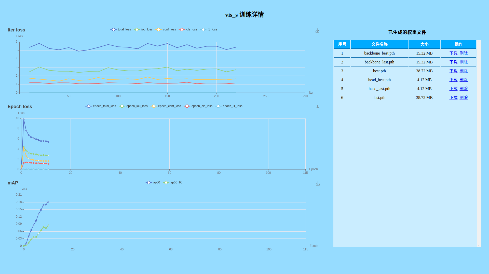

# WEB-YOLOX: 打开网页，实时管理你的YOLOX训练过程！

# webyolox（具体参照https://github.com/LSH9832/webyolox/tree/main/yolox）
WEB-YOLOX: 打开网页，实时管理你的YOLOX训练过程！
非常感谢LSH9832将自己的网页管理端界面部署代码无私分享，感谢旷视研究院推出的YOLOX，最终结合我们已经训练好的模型，完成了我们自己的红火蚁巢穴识别模型和网页端管理界面。